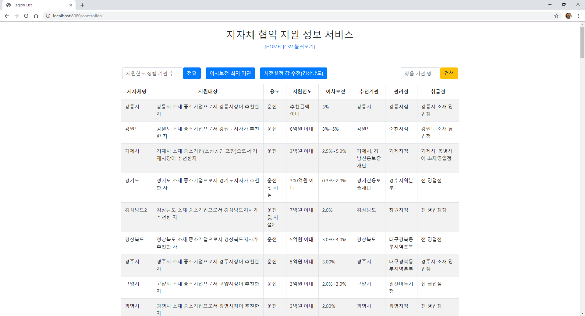

# 소개
####중소기업은행 지자체 협약 지원 정보 서비스 API
-----

##1. 개발 프레임워크
- **Java/Spring**
- **JDK 1.8**
- **MyBatis**
- **MySQL**
- **JUnit**

 
 

##2. 문제해결 방법
1. **CSV파일에서 각 레코드를 DB에 저장**
    - .csv 파일을 읽어들여 DB에 List형식으로 넘겨 Insert 수행.

1. **지원하는 지자체 목록 검색**
    - DB에 Insert된 전체 data를 Select 하여 JSON형태로 .jsp로 보냄.

1. **지원하는 지자체명을 입력 받아 해당 지자체의 지원정보 출력**
    - Web에서 입력한 지자체명을 실시간으로 JSON형태로 변환하여 요청하여 결과값을 화면에 반영.

1. **지원하는 지자체 정보 수정 기능**
    - 파라미터로 받은 JSON값으로 PUT요청을 하여 Update 수행.
    - 시연을 위해 임의의 수정 값을 .jsp에 입력해두고 해당 값을 파라미터로 보냄.

1. **지원한도 내림차순 정렬(지원한도 동일 시, 이차보전 평균비율 오름차순)**
    - 출력 개수 K 입력 받음.
    - 지원한도 내림차순 정렬.
    - 이차보전 평균비율 오름차순 정렬(숫자로 변형 후, 정렬).
        1. 문자열 시작이 숫자가 아닌 경우 0%로 처리(eg. 대출이자 전액▶0).
        1. 문자열에 물결표(~)가 없는경우, 문자열에서 '%' 직전 문자를 숫자로 변환(eg. 3.0%▶3.0).
        1. 그 외의 문자열은 물결표를 기준으로 두 값으로 분리 후, 각각의 '%'문자 제거 및 숫자로 변경. 그리고 두 값을 더하여 2로 나눈 값을 취함(eg. 1.5%~4.0%▶2.75).
    - LIMIT #{K}로 상위 K개 값을 반환 함.

1. **이차보전 비율이 가장 작은 추천 기관명 출력**
    - 이차보전 오름차순 정렬.
      - 문자열 시작이 숫자가 아닌 경우 0%로 처리(eg. 대출이자 전액▶0).
    - LIMIT 1 로 최상위 값을 반환 함.

 

###2-1. Entity 설계
#####RG_INFORM
region_cd | region_nm
--------- | ---------
RG101 | 강릉시

#####RG_APPLY_DATA
id | region_cd | target | usage | limit | rate | institute | mgmt | reception | reg_dt | upd_dt
-- | --------- | ------ | ----- | ----- | ---- | --------- | ---- | --------- | ------ | ------
1 | RG101 | 강릉시 소재 중소기업으로서 강릉시장이 추천한 자 | 운전 | 추천금액 이내 | 3% | 강릉시 | 강릉지점 | 강릉시 소재 영업점 | 2019-06-10 21:58:47 | 2019-06-11 07:43:14

 
###2-2. ER Diagram

- RG_INFORM 테이블에 지자체코드가 들어가고, RG_APPLY_DATA.region_cd가 외래키로 참조 하는 구조.

 
 

##3. 빌드 및 실행 방법
1. STS or Eclipse 내 Import
 
2. 홈페이지 접속
    - http://localhost:8080/controller/
    
 
3. 기능 별 수행
    1. 상위 탭 메뉴
        - HOME : 메인리스트 화면으로 이동
        - CSV 불러오기 : assign01.csv 파일을 읽어와서 DB에 Insert(최초 1회 수행필요).
    2. HOME 화면 내 기능
        - 지원한도 정렬
        - 이차보전 정렬
        - 특정 행 수정(사전지정 값)
        - 지자체명 검색

 

_dsfsgf_
*강조*
강조

**강조**

[예제 링크](http://www.example.com "사이트제목")
